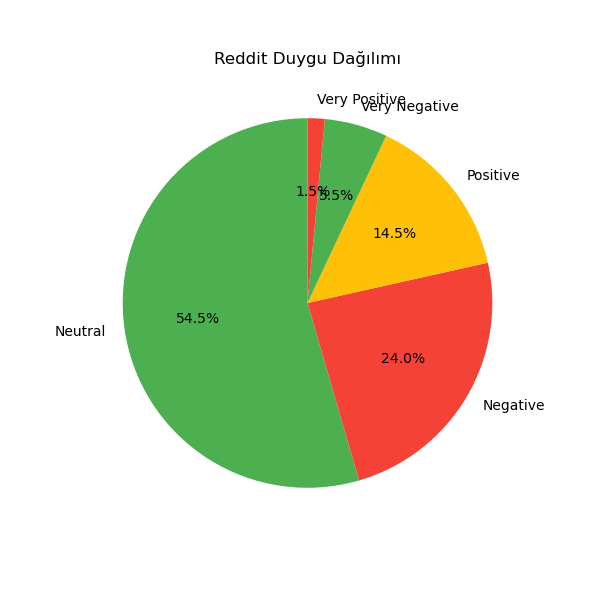
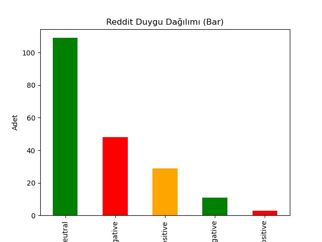

# Reddit-Sentiment-Analysis

# Reddit Multilingual Sentiment Analysis 📈🤖

This project is a **Reddit post sentiment analysis system** built with Python. Users can analyze one or multiple subreddits, and the results are provided as **CSV outputs**, **graphical visualizations**, and **word clouds**. The project focuses on **multilingual sentiment analysis**, supporting both **Turkish** and **English** posts.

---

## 🚀 Project Objective

- Analyze community sentiment on Reddit  
- Perform multilingual text analysis  
- Visualize results for better insights  
- Build a sentiment analysis pipeline suitable for portfolios or data science projects

---

## ⚙️ Technologies & Libraries

| Technology / Library       | Purpose |
|----------------------------|---------|
| Python 3.8+                | Main programming language |
| PRAW (Python Reddit API Wrapper) | Fetch Reddit data |
| Pandas                     | Data processing & CSV export |
| Matplotlib                 | Graphs and visualization |
| WordCloud                  | Generate word clouds |
| Transformers (HuggingFace) | Multilingual sentiment analysis model |
| Torch                      | Deep learning backend for the model |
| NLTK                       | Stopwords and text preprocessing |
| re                         | Regex and text cleaning |

---

## 📦 Installation & Setup

### 1. Install Required Packages

```bash
pip install praw pandas matplotlib wordcloud transformers torch nltk
```

### 2. Download NLTK Stopwords
```bash
import nltk
nltk.download('stopwords')
```
### 3. Reddit API Setup
1.Go to Reddit Apps and create a script type app.

2.Copy your client_id, client_secret, and user_agent.

3.Update them in reddit_sentiment.py.

### 4. Run the Program
```bash
python reddit_sentiment.py
```
The program will prompt for one or more subreddits (comma-separated):
```bash
Enter the subreddits to analyze, separated by commas (e.g., iPhone,Android):
```
For each subreddit, the program will:

-Fetch posts from Reddit
-Perform sentiment analysis (positive/negative/neutral)
-Save results to CSV (reddit_<subreddit>_analysis_results.csv)
-Generate Pie chart and Bar chart
-Generate a Word Cloud (stopwords removed)

### 🔍 Data Processing & Analysis

Data Collection:

-Hot posts are fetched using PRAW (limit adjustable).
-Post titles (title) are used for sentiment analysis.

Text Preprocessing:

-Links and special characters are cleaned using regex.
-Stopwords in Turkish and English are removed.

Sentiment Analysis:

-HuggingFace model tabularisai/multilingual-sentiment-analysis is used.
-Posts longer than 512 characters are truncated for model input.
-Outputs include the label and confidence score for each post.

Visualization:

-Pie Chart: Shows percentage distribution of sentiment labels.
-Bar Chart: Shows counts of each sentiment.
-Word Cloud: Highlights frequently used words after removing stopwords.

### 📊 Example Outputs
## Ekran Görüntüsü




### 🔧 Customization & Development Tips

-Increase Post Limit: Adjust the limit parameter in get_reddit_posts().

-Sorting Options: hot, new, top, rising.

-Custom Stopwords: Add domain-specific words to the stopwords list.

-Positive / Negative Word Clouds: Generate separate word clouds per sentiment.

-Multi-Subreddit Comparison: Compare sentiment distribution across multiple subreddits.

-Interactive Dashboard: Use Streamlit or Flask for live visualization.


